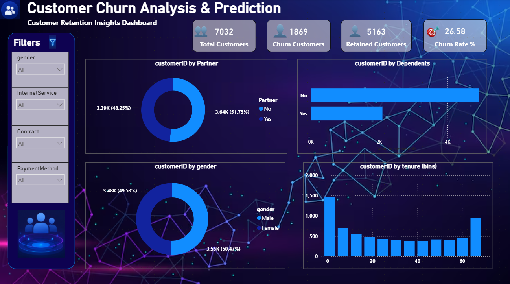
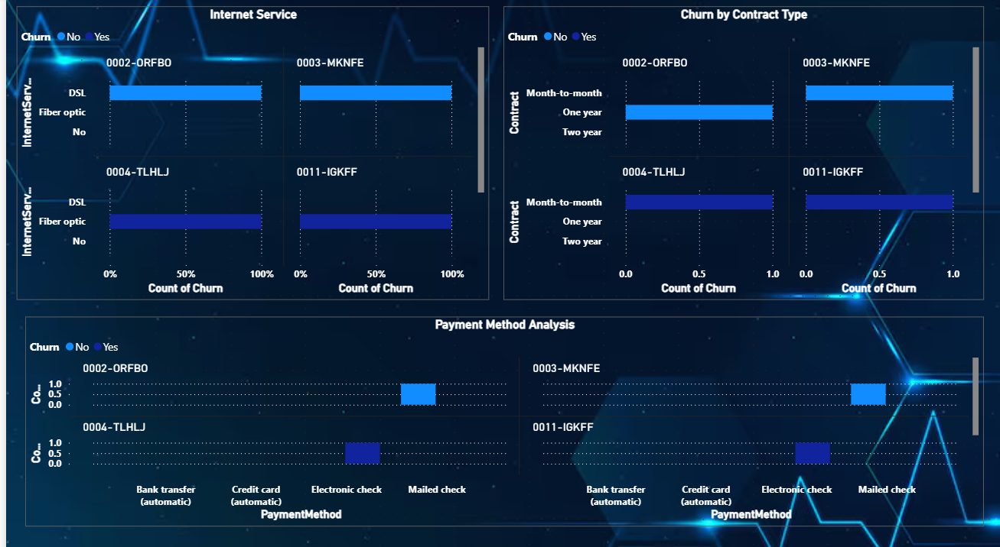

# 📊 Customer Churn Analysis & Prediction

## 📌 Project Overview

This project presents an interactive **Customer Churn Analysis & Prediction Dashboard** developed using **Microsoft Power BI**.

The dashboard analyzes customer demographics, services, contracts, payment methods, tenure, and churn behavior to provide insights into customer retention and churn patterns.

---

## 🎯 Project Objective

The main objective of this project is to:

- Analyze customer churn patterns
- Understand customer retention behavior
- Identify factors associated with customer churn
- Analyze customer demographics and service usage
- Provide interactive business insights using Power BI

---

## 🛠️ Tools & Technologies

- **Microsoft Power BI**
- **Power Query**
- **DAX**
- **Data Cleaning & Transformation**
- **Data Visualization**
- **Data Analysis**

---

## 📈 Key Performance Indicators

| KPI | Value |
|---|---:|
| Total Customers | 7,043 |
| Churn Customers | 1,869 |
| Retained Customers | 5,174 |
| Churn Rate | 26.5% |

---

## 📊 Dashboard Features

### Customer Overview

The dashboard provides an overview of:

- Total customers
- Churned customers
- Retained customers
- Overall churn rate

### Customer Segmentation

Interactive filters allow users to analyze customers based on:

- Gender
- Internet Service
- Contract
- Payment Method

### Customer Analysis

The dashboard includes visualizations for:

- Customer distribution by Partner
- Customer distribution by Dependents
- Customer distribution by Gender
- Customer distribution by Tenure
- Internet Service analysis
- Churn by Contract Type
- Payment Method analysis

---

## 🖼️ Dashboard Preview

### Page 1 — Customer Churn Overview

### Page 2 — Customer Service & Churn Analysis

---

## 📁 Project Files

| File | Description |
|---|---|
| `Customer Churn Analysis and Prediction Dashboard.pbix` | Power BI project file |
| `Dashboard-Page-1.png` | Dashboard overview screenshot |
| `Dashboard-Page-2.png` | Detailed analysis screenshot |

---

## 🔍 Business Insights

This dashboard can be used to explore:

- Customer churn distribution
- Customer retention patterns
- Differences in churn across customer segments
- Contract-related churn patterns
- Internet service usage
- Payment method distribution
- Customer tenure patterns

These insights can support data-driven customer retention analysis.

---

## 👨‍💻 Project Skills Demonstrated

- Data Cleaning
- Data Transformation
- Data Modeling
- DAX Measures
- Interactive Dashboard Development
- KPI Development
- Data Visualization
- Business Data Analysis
- Power BI Reporting

---

## 📂 Power BI Project

The complete Power BI `.pbix` file is included in this repository.

Open the `.pbix` file using **Microsoft Power BI Desktop** to explore the interactive dashboard.

Manohar Kuttuboina

Aspiring **Data Analyst | Power BI Developer**
